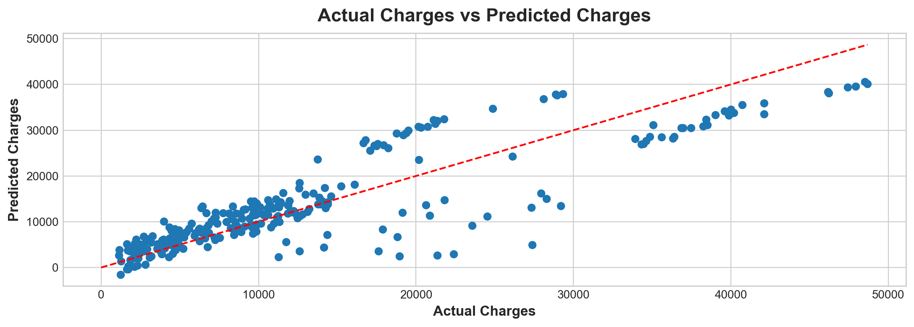

# Project Name: Health Insurance Charges Predictor
This project aims to build a simple linear regression model to predict the charges of health insurance based on various inputs such as age, sex, BMI, number of children, smoker status, and region. The main objective is to identify the significant factors that affect health insurance charges and develop a model that can accurately predict the charges based on these factors. This project will help individuals to understand the factors that can affect their insurance charges and make informed decisions about their health insurance needs. Insurance companies can also use this predictive model to estimate the charges for their clients.

## Table of Contents
* Installation
* Usage

## Installation 
1. Clone the repository:

- git clone https://github.com/edwarjosep11/health-insurance-charges-predictor.git

2. Install the required packages using pip
pip install -r requirements.txt

3. Open the Jupyter notebook: INSURANCE_MACHINE_LEARNING.ipynb

## Usage
- Open your web browser and go to http://localhost:5000/
- Enter the required inputs such as age, sex, BMI, number of children, smoker status, and region
- Use the 'Predict' method.

The predicted health insurance charges will be displayed on the screen.

 

